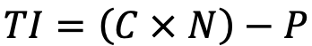
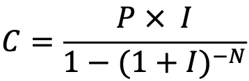
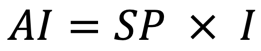
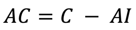

# Práctica Unit Test

Elabore una clase que supla las siguientes responsabilidades

## Requisito #1

Para una compra con tarjeta de crédito, debe calcular el total de intereses que se pagarán en total antes de cancelar el
total de la deuda, dado el valor de la compra, el número de cuotas y la tasa de interés vigente

La formula para calcular el total de intereses esta dado por:

Donde:

TI = Total intereses

C = Cuota mensual

N = Número de cuotas

P = Monto de la compra

La formula para calcular la cuota mensual esta dada por:

Donde:

C = Cuota mensual

P = Monto de la compra

I = Tasa de interes mensual

N = Número de cuotas

## Casos de prueba

### Caso de prueba #1: Caso normal

| Monto  | Tasa | Cuotas | Total Intereses |
|--------|------|--------|-----------------|
| 200000 | 3.1% | 36     | 134726.53       |

### Caso de prueba #2: Caso normal

| Monto  | Tasa | Cuotas | Total Intereses |
|--------|------|--------|-----------------|
| 850000 | 3.4% | 24     | 407059.97       |

### Caso de prueba #3: tasa cero

| Monto  | Tasa | Cuotas | Total Intereses |
|--------|------|--------|-----------------|
| 480000 | 0%   | 48     | 0               |

### Caso de prueba #4: tasa de usura

| Monto | Tasa  | Cuotas | Total Intereses                                   |
|-------|-------|--------|---------------------------------------------------|
| 50000 | 12.5% | 60     | Error: La tasa de interés supera la tasa de usura |

### Caso de prueba #5: cuota única

| Monto | Tasa | Cuotas | Total Intereses |
|-------|------|--------|-----------------|
| 90000 | 2.4% | 1      | 0               |

### Caso de prueba #6: Monto inválido

| Monto | Tasa | Cuotas | Total Intereses                          |
|-------|------|--------|------------------------------------------|
| 0     | 2.4% | 60     | Error: el monto debe ser superior a cero |

### Caso de prueba #7: Cuota negativa

| Monto | Tasa | Cuotas | Total Intereses                                  |
|-------|------|--------|--------------------------------------------------|
| 50000 | 1%   | -10    | Error: el número de cuotas debe ser mayor a cero |

# Requisito #2

Calcular el plan de amortización de la compra, dado el monto de la compra, el número de cuotas y la tasa de interés.

El plan de amortización es el abono que se hace a la deuda de cada cuota, divido entre abono a capital y abono a interés

Para calcular que parte del pago de la cuota se va para abonar intereses y cuanto para abonar al capital tenemos las
siguientes fórmulas:

Donde:

AI = Abono a intereses del mes

SP = Saldo Pendiente

I = Tasa de interés mensual

AC = Abono a capital

C = Cuota mensual

## Casos de prueba

### Caso de prueba #1: cuota única

Datos:

| Valor Compra | Tasa de interés | Número de cuotas | Resultado              |
|--------------|-----------------|------------------|------------------------|
| 90.000       | 2.4%            | 1                | Ver tabla amortización |

Tabla amortización:

| # Cuota | Cuota  | Pago Interés | Abono capital | Saldo |
|---------|--------|--------------|---------------|-------|
| 1       | 90.000 | 0            | 90.000        | 0     |

### Caso de prueba #2: caso normal

Datos:

| Valor Compra | Tasa de interés | Número de cuotas | Resultado              |
|--------------|-----------------|------------------|------------------------|
| 200.000      | 3.1%            | 36               | Ver tabla amortización |

Tabla amortización:

| # Cuota | Cuota    | Pago Interés | Abono capital | Saldo      |
|---------|----------|--------------|---------------|------------|
| 1       | 9,297.96 | 6,200.00     | 3,097.96      | 196,902.04 |
| 2       | 9,297.96 | 6,103.96     | 3,194.00      | 193,708.05 |
| 3       | 9,297.96 | 6,004.95     | 3,293.01      | 190,415.04 |
| 4       | 9,297.96 | 5,902.87     | 3,395.09      | 187,019.94 |
| 5       | 9,297.96 | 5,797.62     | 3,500.34      | 183,519.60 |
| 6       | 9,297.96 | 5,689.11     | 3,608.85      | 179,910.75 |
| 7       | 9,297.96 | 5,577.23     | 3,720.73      | 176,190.02 |
| 8       | 9,297.96 | 5,461.89     | 3,836.07      | 172,353.96 |
| 9       | 9,297.96 | 5,342.97     | 3,954.99      | 168,398.97 |
| 10      | 9,297.96 | 5,220.37     | 4,077.59      | 164,321.38 |
| 11      | 9,297.96 | 5,093.96     | 4,204.00      | 160,117.38 |
| 12      | 9,297.96 | 4,963.64     | 4,334.32      | 155,783.06 |
| 13      | 9,297.96 | 4,829.27     | 4,468.68      | 151,314.38 |
| 14      | 9,297.96 | 4,690.75     | 4,607.21      | 146,707.16 |
| 15      | 9,297.96 | 4,547.92     | 4,750.04      | 141,957.13 |
| 16      | 9,297.96 | 4,400.67     | 4,897.29      | 137,059.84 |
| 17      | 9,297.96 | 4,248.85     | 5,049.10      | 132,010.73 |
| 18      | 9,297.96 | 4,092.33     | 5,205.63      | 126,805.11 |
| 19      | 9,297.96 | 3,930.96     | 5,367.00      | 121,438.11 |
| 20      | 9,297.96 | 3,764.58     | 5,533.38      | 115,904.73 |
| 21      | 9,297.96 | 3,593.05     | 5,704.91      | 110,199.82 |
| 22      | 9,297.96 | 3,416.19     | 5,881.76      | 104,318.05 |
| 23      | 9,297.96 | 3,233.86     | 6,064.10      | 98,253.95  |
| 24      | 9,297.96 | 3,045.87     | 6,252.09      | 92,001.87  |
| 25      | 9,297.96 | 2,852.06     | 6,445.90      | 85,555.96  |
| 26      | 9,297.96 | 2,652.23     | 6,645.72      | 78,910.24  |
| 27      | 9,297.96 | 2,446.22     | 6,851.74      | 72,058.50  |
| 28      | 9,297.96 | 2,233.81     | 7,064.15      | 64,994.35  |
| 29      | 9,297.96 | 2,014.82     | 7,283.13      | 57,711.22  |
| 30      | 9,297.96 | 1,789.05     | 7,508.91      | 50,202.31  |
| 31      | 9,297.96 | 1,556.27     | 7,741.69      | 42,460.62  |
| 32      | 9,297.96 | 1,316.28     | 7,981.68      | 34,478.94  |
| 33      | 9,297.96 | 1,068.85     | 8,229.11      | 26,249.83  |
| 34      | 9,297.96 | 813.74       | 8,484.21      | 17,765.61  |
| 35      | 9,297.96 | 550.73       | 8,747.23      | 9,018.39   |
| 36      | 9,297.96 | 279.57       | 9,018.39      | 0.00       |

### Caso de prueba #3: caso normal

Datos:

| Valor Compra | Tasa de interés | Número de cuotas | Resultado              |
|--------------|-----------------|------------------|------------------------|
| 850.000      | 3.4%            | 24               | Ver tabla amortización |

Tabla amortización:

| # Cuota | Cuota     | Pago Interés | Abono capital | Saldo      |
|---------|-----------|--------------|---------------|------------|
| 1       | 52,377.50 | 28,900.00    | 23,477.50     | 826,522.50 |    
| 2       | 52,377.50 | 28,101.77    | 24,275.73     | 802,246.77 | 
| 3       | 52,377.50 | 27,276.39    | 25,101.11     | 777,145.66 | 
| 4       | 52,377.50 | 26,422.95    | 25,954.55     | 751,191.11 | 
| 5       | 52,377.50 | 25,540.50    | 26,837.00     | 724,354.11 | 
| 6       | 52,377.50 | 24,628.04    | 27,749.46     | 696,604.65 | 
| 7       | 52,377.50 | 23,684.56    | 28,692.94     | 667,911.71 | 
| 8       | 52,377.50 | 22,709.00    | 29,668.50     | 638,243.21 | 
| 9       | 52,377.50 | 21,700.27    | 30,677.23     | 607,565.98 | 
| 10      | 52,377.50 | 20,657.24    | 31,720.26     | 575,845.73 | 
| 11      | 52,377.50 | 19,578.75    | 32,798.74     | 543,046.98 | 
| 12      | 52,377.50 | 18,463.60    | 33,913.90     | 509,133.08 | 
| 13      | 52,377.50 | 17,310.52    | 35,066.97     | 474,066.11 | 
| 14      | 52,377.50 | 16,118.25    | 36,259.25     | 437,806.86 | 
| 15      | 52,377.50 | 14,885.43    | 37,492.07     | 400,314.79 | 
| 16      | 52,377.50 | 13,610.70    | 38,766.80     | 361,548.00 | 
| 17      | 52,377.50 | 12,292.63    | 40,084.87     | 321,463.13 | 
| 18      | 52,377.50 | 10,929.75    | 41,447.75     | 280,015.38 | 
| 19      | 52,377.50 | 9,520.52     | 42,856.98     | 237,158.40 | 
| 20      | 52,377.50 | 8,063.39     | 44,314.11     | 192,844.29 | 
| 21      | 52,377.50 | 6,556.71     | 45,820.79     | 147,023.50 | 
| 22      | 52,377.50 | 4,998.80     | 47,378.70     | 99,644.80  | 
| 23      | 52,377.50 | 3,387.92     | 48,989.58     | 50,655.22  | 
| 24      | 52,377.50 | 1,722.28     | 50,655.22     | 0.00       | 

### Caso de prueba #4: tasa cero

Datos:

| Valor Compra | Tasa de interés | Número de cuotas | Resultado              |
|--------------|-----------------|------------------|------------------------|
| 480.000      | 0%              | 48               | Ver tabla amortización |

Tabla amortización:

| # Cuota | Cuota     | Pago Interés | Abono capital | Saldo      |
|---------|-----------|--------------|---------------|------------|
| 1       | 10,000.00 | 0.0%         | 10,000.00     | 470,000.00 |
| 2       | 10,000.00 | 0.0%         | 10,000.00     | 460,000.00 |
| 3       | 10,000.00 | 0.0%         | 10,000.00     | 450,000.00 |
| 4       | 10,000.00 | 0.0%         | 10,000.00     | 440,000.00 |
| 5       | 10,000.00 | 0.0%         | 10,000.00     | 430,000.00 |
| 6       | 10,000.00 | 0.0%         | 10,000.00     | 420,000.00 |
| 7       | 10,000.00 | 0.0%         | 10,000.00     | 410,000.00 |
| 8       | 10,000.00 | 0.0%         | 10,000.00     | 400,000.00 |
| 9       | 10,000.00 | 0.0%         | 10,000.00     | 390,000.00 |
| 10      | 10,000.00 | 0.0%         | 10,000.00     | 380,000.00 |
| 11      | 10,000.00 | 0.0%         | 10,000.00     | 370,000.00 |
| 12      | 10,000.00 | 0.0%         | 10,000.00     | 360,000.00 |
| 13      | 10,000.00 | 0.0%         | 10,000.00     | 350,000.00 |
| 14      | 10,000.00 | 0.0%         | 10,000.00     | 340,000.00 |
| 15      | 10,000.00 | 0.0%         | 10,000.00     | 330,000.00 |
| 16      | 10,000.00 | 0.0%         | 10,000.00     | 320,000.00 |
| 17      | 10,000.00 | 0.0%         | 10,000.00     | 310,000.00 |
| 18      | 10,000.00 | 0.0%         | 10,000.00     | 300,000.00 |
| 19      | 10,000.00 | 0.0%         | 10,000.00     | 290,000.00 |
| 20      | 10,000.00 | 0.0%         | 10,000.00     | 280,000.00 |
| 21      | 10,000.00 | 0.0%         | 10,000.00     | 270,000.00 |
| 22      | 10,000.00 | 0.0%         | 10,000.00     | 260,000.00 |
| 23      | 10,000.00 | 0.0%         | 10,000.00     | 250,000.00 |
| 24      | 10,000.00 | 0.0%         | 10,000.00     | 240,000.00 |
| 25      | 10,000.00 | 0.0%         | 10,000.00     | 230,000.00 |
| 26      | 10,000.00 | 0.0%         | 10,000.00     | 220,000.00 |
| 27      | 10,000.00 | 0.0%         | 10,000.00     | 210,000.00 |
| 28      | 10,000.00 | 0.0%         | 10,000.00     | 200,000.00 |
| 29      | 10,000.00 | 0.0%         | 10,000.00     | 190,000.00 |
| 30      | 10,000.00 | 0.0%         | 10,000.00     | 180,000.00 |
| 31      | 10,000.00 | 0.0%         | 10,000.00     | 170,000.00 |
| 32      | 10,000.00 | 0.0%         | 10,000.00     | 160,000.00 |
| 33      | 10,000.00 | 0.0%         | 10,000.00     | 150,000.00 |
| 34      | 10,000.00 | 0.0%         | 10,000.00     | 140,000.00 |
| 35      | 10,000.00 | 0.0%         | 10,000.00     | 130,000.00 |
| 36      | 10,000.00 | 0.0%         | 10,000.00     | 120,000.00 |
| 37      | 10,000.00 | 0.0%         | 10,000.00     | 110,000.00 |
| 38      | 10,000.00 | 0.0%         | 10,000.00     | 100,000.00 |
| 39      | 10,000.00 | 0.0%         | 10,000.00     | 90,000.00  |
| 40      | 10,000.00 | 0.0%         | 10,000.00     | 80,000.00  |
| 41      | 10,000.00 | 0.0%         | 10,000.00     | 70,000.00  |
| 42      | 10,000.00 | 0.0%         | 10,000.00     | 60,000.00  |
| 43      | 10,000.00 | 0.0%         | 10,000.00     | 50,000.00  |
| 44      | 10,000.00 | 0.0%         | 10,000.00     | 40,000.00  |
| 45      | 10,000.00 | 0.0%         | 10,000.00     | 30,000.00  |
| 46      | 10,000.00 | 0.0%         | 10,000.00     | 20,000.00  |
| 47      | 10,000.00 | 0.0%         | 10,000.00     | 10,000.00  |
| 48      | 10,000.00 | 0.0%         | 10,000.00     | 0          |

### Caso de prueba #5: tasa usura

Datos:

| Valor Compra | Tasa de interés | Número de cuotas | Resultado              |
|--------------|-----------------|------------------|------------------------|
| 50.000       | 12.4%           | 60               | Ver tabla amortización |

Tabla amortización:

| # Cuota | Cuota    | Pago Interés | Abono capital | Saldo     |
|---------|----------|--------------|---------------|-----------|
| 1       | 6,205.58 | 6,200.00     | 5.58          | 49,994.42 | 
| 2       | 6,205.58 | 6,199.31     | 6.27          | 49,988.14 | 
| 3       | 6,205.58 | 6,198.53     | 7.05          | 49,981.09 | 
| 4       | 6,205.58 | 6,197.66     | 7.93          | 49,973.16 | 
| 5       | 6,205.58 | 6,196.67     | 8.91          | 49,964.25 | 
| 6       | 6,205.58 | 6,195.57     | 10.01         | 49,954.24 | 
| 7       | 6,205.58 | 6,194.33     | 11.26         | 49,942.98 | 
| 8       | 6,205.58 | 6,192.93     | 12.65         | 49,930.33 | 
| 9       | 6,205.58 | 6,191.36     | 14.22         | 49,916.11 | 
| 10      | 6,205.58 | 6,189.60     | 15.98         | 49,900.13 | 
| 11      | 6,205.58 | 6,187.62     | 17.97         | 49,882.16 | 
| 12      | 6,205.58 | 6,185.39     | 20.19         | 49,861.96 | 
| 13      | 6,205.58 | 6,182.88     | 22.70         | 49,839.27 | 
| 14      | 6,205.58 | 6,180.07     | 25.51         | 49,813.75 | 
| 15      | 6,205.58 | 6,176.91     | 28.68         | 49,785.08 | 
| 16      | 6,205.58 | 6,173.35     | 32.23         | 49,752.84 | 
| 17      | 6,205.58 | 6,169.35     | 36.23         | 49,716.61 | 
| 18      | 6,205.58 | 6,164.86     | 40.72         | 49,675.89 | 
| 19      | 6,205.58 | 6,159.81     | 45.77         | 49,630.12 | 
| 20      | 6,205.58 | 6,154.13     | 51.45         | 49,578.67 | 
| 21      | 6,205.58 | 6,147.76     | 57.83         | 49,520.84 | 
| 22      | 6,205.58 | 6,140.58     | 65.00         | 49,455.85 | 
| 23      | 6,205.58 | 6,132.53     | 73.06         | 49,382.79 | 
| 24      | 6,205.58 | 6,123.47     | 82.12         | 49,300.67 | 
| 25      | 6,205.58 | 6,113.28     | 92.30         | 49,208.38 | 
| 26      | 6,205.58 | 6,101.84     | 103.74        | 49,104.63 | 
| 27      | 6,205.58 | 6,088.97     | 116.61        | 48,988.02 | 
| 28      | 6,205.58 | 6,074.51     | 131.07        | 48,856.96 | 
| 29      | 6,205.58 | 6,058.26     | 147.32        | 48,709.64 | 
| 30      | 6,205.58 | 6,039.99     | 165.59        | 48,544.05 | 
| 31      | 6,205.58 | 6,019.46     | 186.12        | 48,357.93 | 
| 32      | 6,205.58 | 5,996.38     | 209.20        | 48,148.73 | 
| 33      | 6,205.58 | 5,970.44     | 235.14        | 47,913.59 | 
| 34      | 6,205.58 | 5,941.29     | 264.30        | 47,649.29 | 
| 35      | 6,205.58 | 5,908.51     | 297.07        | 47,352.22 | 
| 36      | 6,205.58 | 5,871.68     | 333.91        | 47,018.32 | 
| 37      | 6,205.58 | 5,830.27     | 375.31        | 46,643.01 | 
| 38      | 6,205.58 | 5,783.73     | 421.85        | 46,221.16 | 
| 39      | 6,205.58 | 5,731.42     | 474.16        | 45,747.00 | 
| 40      | 6,205.58 | 5,672.63     | 532.95        | 45,214.04 | 
| 41      | 6,205.58 | 5,606.54     | 599.04        | 44,615.00 | 
| 42      | 6,205.58 | 5,532.26     | 673.32        | 43,941.68 | 
| 43      | 6,205.58 | 5,448.77     | 756.81        | 43,184.87 | 
| 44      | 6,205.58 | 5,354.92     | 850.66        | 42,334.21 | 
| 45      | 6,205.58 | 5,249.44     | 956.14        | 41,378.07 | 
| 46      | 6,205.58 | 5,130.88     | 1,074.70      | 40,303.37 | 
| 47      | 6,205.58 | 4,997.62     | 1,207.96      | 39,095.40 | 
| 48      | 6,205.58 | 4,847.83     | 1,357.75      | 37,737.65 | 
| 49      | 6,205.58 | 4,679.47     | 1,526.11      | 36,211.54 | 
| 50      | 6,205.58 | 4,490.23     | 1,715.35      | 34,496.19 | 
| 51      | 6,205.58 | 4,277.53     | 1,928.06      | 32,568.13 | 
| 52      | 6,205.58 | 4,038.45     | 2,167.13      | 30,401.00 | 
| 53      | 6,205.58 | 3,769.72     | 2,435.86      | 27,965.14 | 
| 54      | 6,205.58 | 3,467.68     | 2,737.90      | 25,227.23 | 
| 55      | 6,205.58 | 3,128.18     | 3,077.41      | 22,149.83 | 
| 56      | 6,205.58 | 2,746.58     | 3,459.00      | 18,690.83 | 
| 57      | 6,205.58 | 2,317.66     | 3,887.92      | 14,802.91 | 
| 58      | 6,205.58 | 1,835.56     | 4,370.02      | 10,432.89 | 
| 59      | 6,205.58 | 1,293.68     | 4,911.90      | 5,520.98  | 
| 60      | 6,205.58 | 684.60       | 5,520.98      | 0.00      | 

## Requisito #3

Calcular el efecto de un abono extra en el plan de amortizado de una deuda (calculado según R2) y al que se desea hacer
un abono extraordinario por un valor A, en la cuota número N

## Casos de prueba

### Caso de prueba #1: caso normal

Datos:

| Valor Compra | Tasa de interés | Número de cuotas | Abono extra | Cuota en que se abona | Resultado              |
|--------------|-----------------|------------------|-------------|-----------------------|------------------------|
| 200.000      | 3.1%            | 36               | 53.000      | 10                    | Ver tabla amortización |

Tabla amortización:

| # Cuota | Cuota     | Pago Interés | Abono capital | Saldo      |
|---------|-----------|--------------|---------------|------------|
| 1       | 9,297.96  | 6,200.00     | 3,097.96      | 196,902.04 | 
| 2       | 9,297.96  | 6,103.96     | 3,194.00      | 193,708.05 | 
| 3       | 9,297.96  | 6,004.95     | 3,293.01      | 190,415.04 | 
| 4       | 9,297.96  | 5,902.87     | 3,395.09      | 187,019.94 | 
| 5       | 9,297.96  | 5,797.62     | 3,500.34      | 183,519.60 | 
| 6       | 9,297.96  | 5,689.11     | 3,608.85      | 179,910.75 | 
| 7       | 9,297.96  | 5,577.23     | 3,720.73      | 176,190.02 | 
| 8       | 9,297.96  | 5,461.89     | 3,836.07      | 172,353.96 | 
| 9       | 9,297.96  | 5,342.97     | 3,954.99      | 168,398.97 | 
| 10      | 53,000.00 | 5,220.37     | 47,779.63     | 120,619.34 | 
| 11      | 9,297.96  | 3,739.20     | 5,558.76      | 115,060.58 | 
| 12      | 9,297.96  | 3,566.88     | 5,731.08      | 109,329.50 | 
| 13      | 9,297.96  | 3,389.21     | 5,908.74      | 103,420.75 | 
| 14      | 9,297.96  | 3,206.04     | 6,091.92      | 97,328.84  | 
| 15      | 9,297.96  | 3,017.19     | 6,280.77      | 91,048.07  | 
| 16      | 9,297.96  | 2,822.49     | 6,475.47      | 84,572.60  | 
| 17      | 9,297.96  | 2,621.75     | 6,676.21      | 77,896.39  | 
| 18      | 9,297.96  | 2,414.79     | 6,883.17      | 71,013.22  | 
| 19      | 9,297.96  | 2,201.41     | 7,096.55      | 63,916.67  | 
| 20      | 9,297.96  | 1,981.42     | 7,316.54      | 56,600.13  | 
| 21      | 9,297.96  | 1,754.60     | 7,543.36      | 49,056.78  | 
| 22      | 9,297.96  | 1,520.76     | 7,777.20      | 41,279.58  | 
| 23      | 9,297.96  | 1,279.67     | 8,018.29      | 33,261.28  | 
| 24      | 9,297.96  | 1,031.10     | 8,266.86      | 24,994.43  | 
| 25      | 9,297.96  | 774.83       | 8,523.13      | 16,471.29  | 
| 26      | 9,297.96  | 510.61       | 8,787.35      | 7,683.94   | 
| 27      | 7,922.15  | 238.20       | 7,683.94      | 0.0        | 

### Caso de prueba #2: caso normal

Datos:

| Valor Compra | Tasa de interés | Número de cuotas | Abono extra | Cuota en que se abona | Resultado              |
|--------------|-----------------|------------------|-------------|-----------------------|------------------------|
| 850.000      | 3.4%            | 24               | 90.000      | 5                     | Ver tabla amortización |

Tabla amortización:

| # Cuota | Cuota     | Pago Interés | Abono capital | Saldo      |
|---------|-----------|--------------|---------------|------------|
| 1       | 52,377.50 | 28,900.00    | 23,477.50     | 826,522.50 | 
| 2       | 52,377.50 | 28,101.77    | 24,275.73     | 802,246.77 | 
| 3       | 52,377.50 | 27,276.39    | 25,101.11     | 777,145.66 | 
| 4       | 52,377.50 | 26,422.95    | 25,954.55     | 751,191.11 | 
| 5       | 90,000.00 | 25,540.50    | 64,459.50     | 686,731.61 | 
| 6       | 52,377.50 | 23,348.87    | 29,028.62     | 657,702.99 | 
| 7       | 52,377.50 | 22,361.90    | 30,015.60     | 627,687.39 | 
| 8       | 52,377.50 | 21,341.37    | 31,036.13     | 596,651.26 | 
| 9       | 52,377.50 | 20,286.14    | 32,091.36     | 564,559.91 | 
| 10      | 52,377.50 | 19,195.04    | 33,182.46     | 531,377.44 | 
| 11      | 52,377.50 | 18,066.83    | 34,310.67     | 497,066.78 | 
| 12      | 52,377.50 | 16,900.27    | 35,477.23     | 461,589.55 | 
| 13      | 52,377.50 | 15,694.04    | 36,683.45     | 424,906.10 | 
| 14      | 52,377.50 | 14,446.81    | 37,930.69     | 386,975.41 | 
| 15      | 52,377.50 | 13,157.16    | 39,220.33     | 347,755.07 | 
| 16      | 52,377.50 | 11,823.67    | 40,553.83     | 307,201.25 | 
| 17      | 52,377.50 | 10,444.84    | 41,932.66     | 265,268.59 | 
| 18      | 52,377.50 | 9,019.13     | 43,358.37     | 221,910.22 | 
| 19      | 52,377.50 | 7,544.95     | 44,832.55     | 177,077.67 | 
| 20      | 52,377.50 | 6,020.64     | 46,356.86     | 130,720.81 | 
| 21      | 52,377.50 | 4,444.51     | 47,932.99     | 82,787.82  | 
| 22      | 52,377.50 | 2,814.79     | 49,562.71     | 33,225.11  | 
| 23      | 34,354.76 | 1,129.65     | 33,225.11     | 0          | 

### Caso de prueba #3: Error abono muy bajo

Datos:

| Valor Compra | Tasa de interés | Número de cuotas | Abono extra | Cuota en que se abona | Resultado                                              |
|--------------|-----------------|------------------|-------------|-----------------------|--------------------------------------------------------|
| 850.000      | 3.4%            | 24               | 45.000      | 10                    | Error, el abono debe ser superior a la cuota calculada |

### Caso de prueba #4: Error cuota tardía

Datos:

| Valor Compra | Tasa de interés | Número de cuotas | Abono extra | Cuota en que se abona | Resultado                                                              |
|--------------|-----------------|------------------|-------------|-----------------------|------------------------------------------------------------------------|
| 850.000      | 3.4%            | 24               | 180.000     | 22                    | Error, la cuota extra supera el saldo de la deuda al momento del abono |
